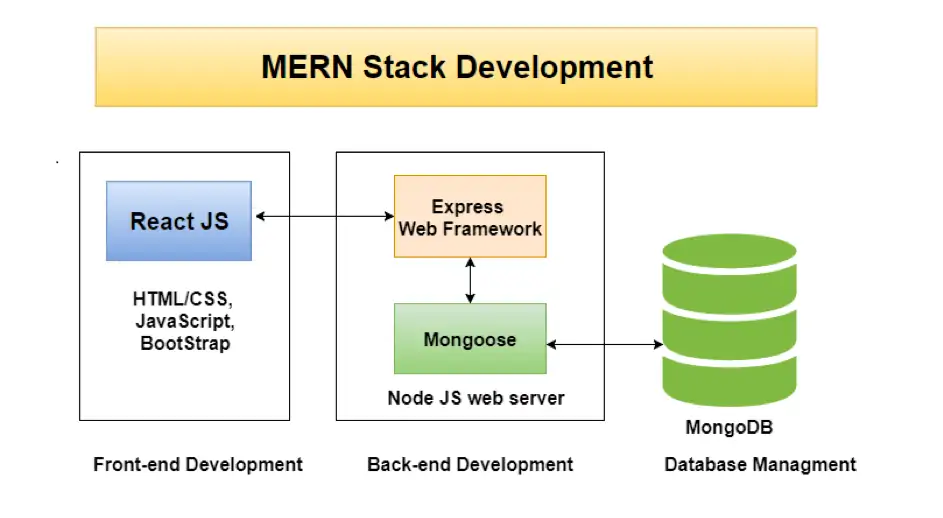

# Support Ticket Services

## [Deployed](https://support-desk-services.herokuapp.com/)

## Demo

---

## Intro

## Table Of Contents

- [INTRO](#intro)
- [SMEAC](#smeac)
- [TECHNOLOGIES](#technologies)
- [LAUNCH](#launch)
- [ILLUSTRATIONS](#illustrations)
- [SCOPE OF FUNCTIONALITIES](#scope-of-functionalities)
- [EXAMPLE OF USE](#example-of-use)
- [PROJECT STATUS](#project-status)
- [SOURCES](#sources)
- [OTHER INFORMATION](#other-information)

## SMEAC

#### (Situation, Mission, Execute, Admin, Comm)

### Situation

Once the user encounters an issue with a product then it's the support services that will improve the users overall experience. The Support Ticket Services serves as a customer facing open line of communication and product troubleshooting. When a user needs help with product support they submit a ticket to Support Ticket Services. A users product experience will help increase revenue and improve company reputation and business relationships.

### Mission

An product issue is encountered by a user and Support Ticket Services will assist in solving any reported issue 24 hours a day. Once a ticket is submitted by a user, a staff member will attempt to solve it through product documentation and troubleshooting steps. A staff member and user can create a note on the ticket and close it if solved.

### Execution

The user must register and log into Support Ticket Services application and submit a ticket. The user will need to select product item from the dropdown box and write a detailed description of the issue. After a ticket is submitted, a user can post additional notes. 

The format includes:

- Problem Statement
- Device and Version
- Browser and Version
- Reproduction Steps
- Expected Outcome
- Actual Outcome
- Notes
- Screenshot

A staff member will see the list of tickets as a "new" and address the issue and create a note on the ticket as they are working through the debugging process. The steps for the staff member to solve the issue are included in this order:

- Utilize Product Documentation
- Reproduce The Issue
- If all resources are exhausted then escalate to jira for dev work

### Admin/Logistics

### Command & Signal

## TECHNOLOGIES

Frontend
- HTML: ReactDOM.Render will pass the Single Page Application through the root element
- CSS: Styling HTML
- JavaScript/JSX: Functional Programming Language across the whole application
- React: UI Library
- Redux ToolKit: Robust State Management
- React Dev Tools

Backend
- Nodejs: Runtime
- Express: Backend Framework, handles endpoints
- MongoDB: Database stores collections
- Mongoose: ODM Object Data Mapper through Express
- Postman: Ground truthing routes and request/response objects
## LAUNCH

## ILLUSTRATIONS

## SCOPE OF FUNCTIONALITIES
Authentication
- Registration
- Login
- JSON Web Token
A users functions include:
- Create a ticket
- Read a ticket

## EXAMPLE OF USE

## PROJECT STATUS

## SOURCES

## OTHER INFORMATION
